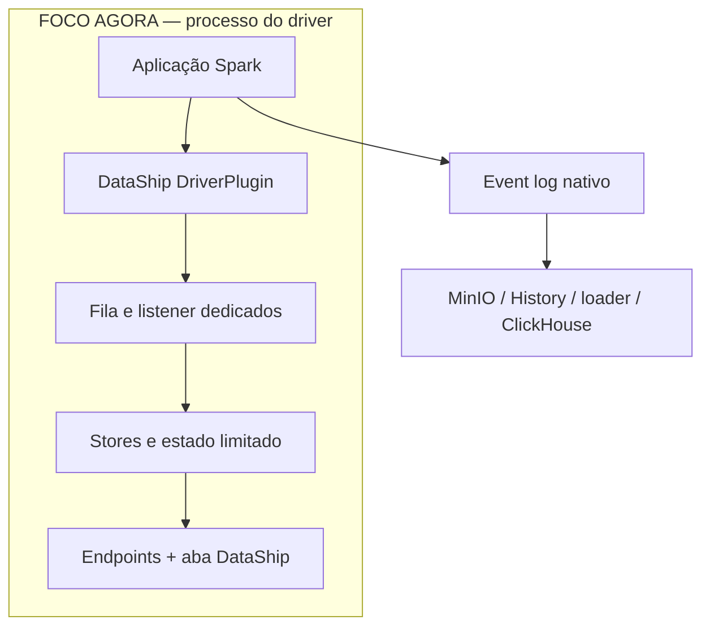
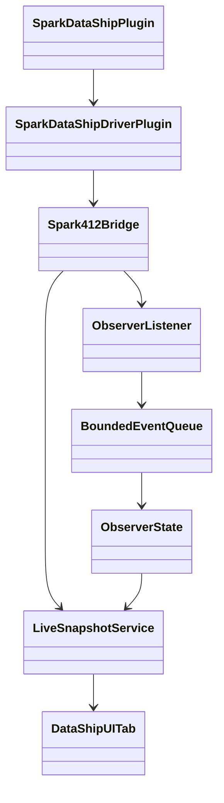
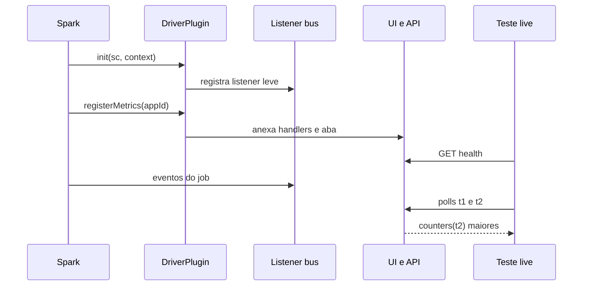

# DataShip Spark Observer v0 — design do caminho live no driver

- **Status:** proposta de design aprovada para decomposição em tarefas
- **Data:** 2026-07-15
- **Persistido no repositório:** 2026-07-16
- **Repositório-alvo:** `Gabriel-Philot/dataship-spark-plat-v0`
- **Baseline revalidada:** commit `89202730dfd19d35d52c35d61b739dad4fcca345`
- **Escopo ativo:** JAR, driver, listeners, estado live, endpoints, aba da Spark UI e testes de execução
- **Escopo preservado, mas não desenvolvido agora:** event logs no MinIO, Spark History Server, loader Go e ClickHouse

---

## 1. Decisão executiva

O primeiro DataShip Spark Observer será um plugin JVM carregado exclusivamente no driver do Spark. Ele seguirá o desenho inicial observado no DataFlint:

1. uma implementação de `SparkPlugin`;
2. um `DriverPlugin` real;
3. nenhum plugin nos executors;
4. instalação leve no `init`;
5. instalação da UI e dos endpoints depois que `appId` e Spark UI estiverem disponíveis;
6. uma fila de listener dedicada;
7. leitura dos stores nativos do Spark;
8. uma aba e recursos HTTP anexados à Spark UI do driver.

O objetivo desta etapa não é reproduzir todas as funcionalidades do DataFlint. O objetivo é construir a menor fatia vertical que prove, de forma repetível, que nosso JAR:

- foi carregado pelo driver;
- recebe eventos enquanto a aplicação ainda está executando;
- consegue consultar o estado live do Spark;
- responde por endpoints do próprio driver;
- apresenta uma aba mínima dentro da Spark UI;
- continua funcionando sob limites e falhas controladas;
- não interfere no resultado do job Spark.

O caminho durável já existente continua intacto:

```text
Spark event log -> MinIO -> History Server -> loader Go -> ClickHouse
```

Ele será usado apenas como teste de regressão ao final. Não haverá, nesta fase, escrita customizada do plugin no MinIO, Kafka ou ClickHouse.

---

## 2. O que significa “lado esquerdo” neste documento

O lado esquerdo é tudo o que acontece dentro do processo do driver e pode ser validado enquanto o `spark-submit` ainda está vivo.



O bloco `MinIO / History / loader / ClickHouse` permanece no desenho para deixar clara a arquitetura completa, mas não receberá novas features durante o desenvolvimento do JAR.

### Alterações permitidas nesta fase

- novo módulo Scala para o plugin;
- build e empacotamento do JAR;
- ativação opt-in no `spark-submit` de teste;
- exposição local da Spark UI do driver;
- workload Spark criado especificamente para observabilidade live;
- scripts, Make targets e testes do plugin;
- documentação do contrato e evidências.

### Alterações congeladas nesta fase

- schemas do ClickHouse;
- código do loader Go;
- prefixos e buckets do MinIO;
- caminho do event log nativo;
- ingestão automática do loader;
- Kafka;
- dashboards construídos sobre ClickHouse.

Se uma mudança no lado direito parecer necessária para fazer o plugin funcionar, a execução deve parar e registrar a necessidade como decisão de arquitetura. Ela não deve ser introduzida silenciosamente.

---

## 3. Estado atual da plataforma que condiciona o design

A baseline do repositório foi revalidada antes deste documento.

- A imagem é `apache/spark:4.1.2-scala2.13-java17-python3-ubuntu`.
- O `spark-submit` usa Standalone, `deploy-mode client`, executado dentro do container `spark-master`.
- Portanto, o processo do driver nasce dentro do container `spark-master`.
- A Spark UI do master usa a porta 8080; ela não é a UI do driver.
- A UI do driver deve nascer na porta 4040, que ainda não está publicada no Compose.
- O Dockerfile do Spark já copia os JARs preparados para `/opt/spark/jars/`.
- O event log nativo já está habilitado em `s3a://spark-logs/events`.
- O History Server lê o mesmo prefixo e usa intervalo de atualização de dois segundos.
- O loader Go continua manual, acionado pelo target `make spark-logs`.

Fontes da baseline:

- [Makefile do v0](https://github.com/Gabriel-Philot/dataship-spark-plat-v0/blob/89202730dfd19d35d52c35d61b739dad4fcca345/Makefile)
- [Docker Compose do v0](https://github.com/Gabriel-Philot/dataship-spark-plat-v0/blob/89202730dfd19d35d52c35d61b739dad4fcca345/build/docker-compose.yml)
- [spark-defaults.conf do v0](https://github.com/Gabriel-Philot/dataship-spark-plat-v0/blob/89202730dfd19d35d52c35d61b739dad4fcca345/build/config/spark/spark-defaults.conf)
- [Dockerfile do Spark no v0](https://github.com/Gabriel-Philot/dataship-spark-plat-v0/blob/89202730dfd19d35d52c35d61b739dad4fcca345/build/images/spark/Dockerfile)

### Consequência prática para o teste live

A confirmação de tempo real deve ser feita consultando a porta do driver enquanto o processo `spark-submit` está ativo. A porta 28081 já existente mostra o Spark master, não o estado interno do driver da aplicação.

Para o teste local inicial, o Compose deverá publicar uma porta como:

```text
127.0.0.1:${SPARK_DRIVER_UI_PORT:-24040}:4040
```

O bind em `127.0.0.1` é intencional: a Spark UI local não deve ser exposta para a rede por padrão.

A primeira versão aceitará apenas um driver de teste por vez nessa porta fixa. Concorrência entre vários drivers será um requisito futuro.

---

## 4. Referência arquitetural: o recorte inicial do DataFlint

“Imitar o DataFlint” neste documento significa reproduzir seu padrão estrutural mínimo e aprender com seus pontos de integração. Não significa copiar nome, marca, interface visual ou todo o código.

A referência foi fixada no commit DataFlint `111862460cf88eb0a85d7bee18597d980818379e`, para que uma alteração futura no `main` não mude silenciosamente o que foi usado como base.

### 4.1 Estruturas do DataFlint que serão imitadas

| Estrutura observada no DataFlint | Decisão no DataShip | Motivo |
| --- | --- | --- |
| `SparkDataflintPlugin` implementa `SparkPlugin` | `SparkDataShipPlugin` implementará `SparkPlugin` | Entrada nativa do sistema de plugins do Spark |
| `driverPlugin()` retorna implementação real | O DataShip terá um `DriverPlugin` | Toda a observabilidade live desta fase mora no driver |
| `executorPlugin()` retorna `null` | O DataShip também retornará `null` | Evita distribuição, memória e falhas extras nos executors |
| `init` guarda o `SparkContext` e faz bootstrap mínimo | O `init` só validará configuração e instalará coleta leve | O `init` bloqueia a inicialização do driver |
| `registerMetrics` instala a UI depois | A aba e os handlers serão instalados nessa fase tardia | Nesse momento `appId` e subsistemas já estão disponíveis |
| Loader comum acessa `context.ui`, listener bus e status store | Um adaptador Spark 4.1.2 fará o mesmo, com superfície mínima | É o caminho usado para integrar com a UI nativa |
| Listener é adicionado a uma fila chamada `dataflint` | O DataShip usará fila dedicada `dataship-observer` | Isola o processamento do listener das outras filas |
| Processamento live ocorre a partir do listener dedicado | O DataShip acrescentará um handoff interno limitado antes de qualquer normalização não trivial | Divergência deliberada para medir backpressure e nunca bloquear a fila do Spark |
| Uma aba e recursos estáticos são anexados à Spark UI | O DataShip anexará `/dataship/` e endpoints versionados | Mantém live UI e API no processo do driver |
| Spark 4 possui módulo Scala 2.13 e dependências Spark `provided` | O primeiro artefato será específico para Scala 2.13/Spark 4.1.2 | Evita conflito com o runtime já fornecido pelo Spark |

Referências diretas:

- [Bootstrap Spark 4 do DataFlint](https://github.com/dataflint/spark/blob/111862460cf88eb0a85d7bee18597d980818379e/spark-plugin/pluginspark4/src/main/scala/io/dataflint/spark/SparkDataflintPlugin.scala)
- [Instalador comum, listener, stores e aba da UI](https://github.com/dataflint/spark/blob/111862460cf88eb0a85d7bee18597d980818379e/spark-plugin/plugin/src/main/scala/org/apache/spark/dataflint/DataflintSparkUICommonLoader.scala)
- [Separação de módulos e build do artefato Spark 4](https://github.com/dataflint/spark/blob/111862460cf88eb0a85d7bee18597d980818379e/spark-plugin/build.sbt)
- [Cliente da UI e polling live](https://github.com/dataflint/spark/blob/111862460cf88eb0a85d7bee18597d980818379e/spark-ui/src/services/SparkApi.tsx)
- [Licença Apache 2.0 do DataFlint](https://github.com/dataflint/spark/blob/111862460cf88eb0a85d7bee18597d980818379e/LICENSE)

### 4.2 Partes atuais do DataFlint que não serão imitadas agora

- exporter SaaS e token;
- integração Delta Lake;
- métricas Iceberg;
- cache observability avançada;
- instrumentação de operadores físicos;
- extensão que altera ou envolve planos Spark;
- plugin do History Server;
- SPA completa e todos os gráficos;
- suporte Spark 3, Databricks ou múltiplas versões;
- armazenamento histórico próprio.

Esses itens não são necessários para provar o núcleo live e aumentariam muito a superfície de falha.

### 4.3 Código, licença e identidade

O DataFlint está publicado sob Apache License 2.0. Mesmo assim, a implementação preferida para este experimento é própria, guiada por interfaces e padrões arquiteturais. Não usar nome, marca ou assets visuais do DataFlint. Se algum trecho de código for efetivamente adaptado no futuro, a execução deve identificar o trecho e preservar as obrigações de licença e atribuição.

---

## 5. Arquitetura proposta do JAR

### 5.1 Visão de componentes



### 5.2 Responsabilidades

#### `SparkDataShipPlugin`

- implementar `SparkPlugin`;
- retornar `SparkDataShipDriverPlugin` em `driverPlugin()`;
- retornar `null` em `executorPlugin()`;
- não executar trabalho adicional.

#### `SparkDataShipDriverPlugin`

- validar flags e versão do runtime;
- guardar as referências mínimas necessárias;
- iniciar o coletor leve;
- instalar handlers e aba quando o Spark estiver pronto;
- encerrar worker e recursos no `shutdown()`;
- capturar falhas do observador sem derrubar o job.

#### `Spark412Bridge`

- concentrar todo acesso a APIs `private[spark]` ou internas;
- adicionar listeners à fila dedicada;
- localizar `SparkUI`, `AppStatusStore` e estado SQL;
- anexar handlers e uma aba à UI;
- fornecer uma fronteira substituível para futuras versões do Spark.

As classes que precisam acessar membros `private[spark]` provavelmente terão de ficar sob um namespace como `org.apache.spark.dataship.v412`, seguindo o mesmo tipo de solução usada pelo DataFlint. Nenhuma outra camada do projeto poderá importar APIs internas diretamente.

#### `ObserverListener`

- receber eventos da fila dedicada;
- fazer somente classificação, contagem e handoff não bloqueante;
- nunca chamar MinIO, Kafka, ClickHouse ou endpoints externos;
- nunca construir respostas HTTP;
- nunca conservar uma lista ilimitada de tasks ou eventos.

#### `BoundedEventQueue` e `ObserverState`

- usar capacidade fixa e `offer` não bloqueante;
- processar itens por um único worker daemon;
- agregar contadores e conservar apenas uma janela pequena de transições;
- contabilizar toda recusa da fila;
- fechar de forma idempotente no shutdown;
- não substituir os stores nativos como fonte de jobs, stages ou SQL.

#### `LiveSnapshotService`

- ler de forma read-only os stores nativos do Spark;
- combinar stores com os contadores do plugin;
- aplicar limites, paginação, truncamento e redação;
- gerar DTOs estáveis, sem entregar objetos internos do Spark diretamente;
- manter o contrato JSON independente das classes internas.

#### `DataShipUITab`

- anexar uma aba pequena à Spark UI;
- servir assets estáticos empacotados no JAR;
- consultar endpoints do mesmo driver;
- fazer polling somente enquanto a aplicação estiver em modo live;
- mostrar saúde, app, jobs, stages, SQL e contadores básicos.

### 5.3 Fonte de verdade e memória

O DataShip não criará uma segunda cópia completa do estado do Spark.

- Jobs, stages e aplicação: leitura do `AppStatusStore` nativo.
- SQL: leitura da store/listener SQL nativa, por meio do adaptador 4.1.2.
- Estado específico do plugin: contadores e uma janela pequena de transições recentes.
- Tasks: agregadas por `stageId` e `stageAttemptId`; sem retenção de cada task.

Esse desenho se aproxima do DataFlint, que também usa stores e listeners do Spark, e reduz memória duplicada.

### 5.4 Duas camadas de proteção de fila

1. **Fila do listener bus do Spark:** fila dedicada `dataship-observer`, com capacidade configurável.
2. **Handoff interno do plugin:** fila limitada e não bloqueante, consumida por um worker daemon. Mesmo que a primeira normalização seja pequena, esta camada existirá para tornar backpressure, descarte e shutdown diretamente testáveis.

O callback nunca aguardará espaço. Se o handoff interno estiver cheio, o evento é descartado apenas pelo observador e o descarte é contabilizado.

Os contadores internos deverão respeitar:

```text
listener_received = processed + queued + in_flight + dropped_by_plugin
```

O documento e a UI devem separar `dropped_by_plugin` de descartes reportados pela fila do Spark. Não somar métricas de origens diferentes como se fossem a mesma coisa.

### 5.5 Lifecycle



---

## 6. Compatibilidade e empacotamento

### 6.1 Matriz inicial suportada

| Componente | Versão inicial |
| --- | --- |
| Spark | 4.1.2 |
| Scala binary | 2.13 |
| Java | 17 |
| Deploy mode | Standalone client dentro do `spark-master` |
| Linguagem do workload | PySpark inicialmente; o plugin continua JVM |

“Spark 4.1+” será uma meta de evolução, não uma promessa do primeiro JAR. O uso de APIs internas exige validação por versão exata.

### 6.2 Tecnologia do JAR

- Scala 2.13;
- sbt;
- sbt-assembly apenas quando necessário para juntar código e recursos próprios;
- Spark e Scala como dependências `provided`;
- Scala runtime excluído do artefato;
- evitar dependências externas no runtime do v0;
- nome sugerido: `dataship-spark-observer_2.13-0.1.0-SNAPSHOT.jar`.

Scala é a escolha mais direta porque o ponto de integração inclui APIs Scala e internas do Spark. Java ou Kotlin também geram JAR, mas adicionariam adaptação sem reduzir o risco principal desta fase.

### 6.3 Layout conceitual sugerido

```text
spark-observer/
  build.sbt
  project/
  src/main/scala/io/dataship/spark/observer/
  src/main/scala/org/apache/spark/dataship/v412/
  src/main/resources/io/dataship/spark/observer/ui/
  src/test/scala/
  src/it/
```

Os caminhos definitivos serão fechados no plano executável após a revisão deste design.

### 6.4 Ativação opt-in

O plugin não será colocado inicialmente em `spark-defaults.conf` para todos os jobs. O workload de teste usará configuração equivalente a:

```text
--conf spark.plugins=io.dataship.spark.observer.SparkDataShipPlugin
--conf spark.dataship.observer.enabled=true
```

O fato de o JAR estar presente em `/opt/spark/jars/` não deve ativá-lo sozinho.

---

## 7. Contrato HTTP inicial

Os endpoints serão anexados à mesma Spark UI. Não será iniciado um segundo servidor HTTP.

Os handlers deverão passar pelo mesmo caminho de filtros e segurança da Spark UI. No ambiente local, isso será reforçado pelo bind somente em `127.0.0.1`; o design não pressupõe que uma Spark UI sem autenticação possa ser publicada na internet.

### 7.1 Rotas mínimas

| Rota | Objetivo | Obrigatória no primeiro corte |
| --- | --- | --- |
| `GET /dataship/api/v1/health` | Provar carregamento, versão e lifecycle | Sim |
| `GET /dataship/api/v1/debug/counters` | Provar chegada e processamento de eventos | Sim |
| `GET /dataship/api/v1/snapshot` | Expor app, jobs, stages e SQL de forma limitada | Sim |
| `GET /dataship/` | Mostrar aba/página mínima | Sim, após os endpoints |

### 7.2 Envelope estável

Toda resposta JSON bem-sucedida deverá conter, no mínimo:

```json
{
  "schemaVersion": "v1",
  "pluginVersion": "0.1.0-SNAPSHOT",
  "sparkVersion": "4.1.2",
  "appId": "app-...",
  "mode": "live",
  "capturedAt": "2026-07-15T12:00:00Z"
}
```

O teste não deve comparar timestamps ou IDs completos fixos. Deve validar tipo, presença, formato e relações entre valores.

### 7.3 `health`

Campos esperados:

- `status`: `STARTING`, `READY`, `DEGRADED`, `DISABLED` ou `STOPPING`;
- `uiAttached`;
- `listenerInstalled`;
- `supportedRuntime`;
- `queueCapacity`;
- `lastErrorCode`, sem stack trace ou segredo.

Um plugin degradado não significa automaticamente um job Spark falho.

### 7.4 `debug/counters`

Campos esperados:

- eventos recebidos por categoria;
- processados;
- enfileirados;
- em processamento;
- descartados pelo plugin;
- falhas internas;
- profundidade e capacidade da fila;
- timestamp do último evento;
- resultado da verificação do invariante.

Esse endpoint é o principal instrumento para o Codex provar que “está chegando” durante a execução.

### 7.5 `snapshot`

Recorte inicial:

- resumo da aplicação;
- jobs recentes e seus estados;
- stages recentes e seus estados/agregados de tasks;
- execuções SQL recentes;
- indicação de truncamento ou paginação;
- saúde do observador.

Não retornar:

- `SparkConf` completo;
- variáveis de ambiente;
- credenciais;
- objetos Java/Scala serializados diretamente;
- uma coleção ilimitada;
- fonte Python/Scala do usuário;
- SQL sem redação e truncamento.

### 7.6 Códigos de resposta

- `200`: recurso disponível;
- `400`: parâmetro inválido;
- `404`: rota ou entidade inexistente;
- `409`: store ainda não pronta para aquela consulta;
- `429`: proteção local contra consulta excessiva, se necessária;
- `500`: erro isolado do endpoint, sem derrubar o driver.

---

## 8. UI inicial inspirada no padrão do DataFlint

A semelhança desejada é arquitetural:

- uma aba adicional dentro da Spark UI;
- assets estáticos empacotados no JAR;
- endpoints servidos pelo driver;
- polling em modo live;
- leitura de status nativo e dados do listener.

A UI inicial não tentará reproduzir o visual completo do DataFlint. Ela deve ser diagnóstica e pequena.

### Conteúdo mínimo da página

1. estado do plugin;
2. `appId`, Spark version e plugin version;
3. jobs ativos/concluídos/falhos;
4. stages ativos/concluídos/falhos;
5. execuções SQL ativas/concluídas/falhas;
6. profundidade da fila;
7. eventos recebidos/processados/descartados;
8. timestamp da última atualização.

### Polling

O DataFlint atual consulta periodicamente sua API em modo live. O DataShip começará com polling de um segundo apenas para respostas pequenas de resumo. Consultas detalhadas não devem ser executadas automaticamente em todo poll.

---

## 9. Protocolo obrigatório para cada execução do LLM/Codex

Este é o núcleo operacional do experimento. Nenhuma fatia deve ser considerada pronta porque “compilou” ou porque o código parece correto.

### 9.1 Uma execução, uma hipótese observável

Cada iteração deve declarar antes da mudança:

```text
Hipótese:
Mudança mínima:
Comando que deve falhar antes:
Comando que deve passar depois:
Retorno observável esperado:
Regressão que precisa continuar passando:
```

Exemplo de hipótese válida:

```text
Quando um job com o plugin estiver vivo, GET /dataship/api/v1/health
retornará HTTP 200, appId não vazio, sparkVersion=4.1.2 e status=READY.
```

Exemplo inválido:

```text
Implementar a observabilidade inteira.
```

### 9.2 Loop obrigatório

1. Registrar baseline e arquivos que serão alterados.
2. Criar ou ajustar primeiro o teste da fatia.
3. Executar o teste e confirmar que ele falha pela razão esperada.
4. Fazer a menor implementação possível.
5. Executar o teste estreito.
6. Executar o gate de regressão aplicável.
7. Consultar o retorno real, não apenas logs de compilação.
8. Registrar `PASS`, `FAIL` ou `BLOCKED` com o comando e a evidência.
9. Só iniciar a próxima fatia quando a atual estiver `PASS`.

Se falhar, o Codex deve diagnosticar a causa antes de adicionar mais funcionalidade. Não empilhar mudanças para “ver se no final funciona”.

### 9.3 Evidência mínima de uma resposta HTTP

Uma rota só passa quando houver validação automática de:

- processo Spark ainda ativo no momento da requisição;
- conexão TCP bem-sucedida;
- status HTTP esperado;
- `Content-Type` esperado;
- JSON parseável;
- `schemaVersion` esperada;
- campos obrigatórios;
- tipos corretos;
- nenhuma credencial ou segredo conhecido na resposta.

### 9.4 Evidência mínima de eventos live

O teste deve fazer pelo menos duas leituras enquanto o workload está rodando:

```text
t1: processo vivo, counters.listenerReceived = N
t2: processo vivo, counters.listenerReceived > N
```

Também deve provar ao menos uma transição real:

- job `RUNNING` para `SUCCEEDED`;
- stage ativo para completo;
- SQL ativo para completo;
- ou aumento de tasks concluídas dentro do mesmo stage.

Consultar o endpoint apenas depois que o job terminou não prova funcionamento live.

### 9.5 Formato da prestação de contas do Codex

Ao concluir cada iteração, a resposta deve incluir:

| Campo | Conteúdo |
| --- | --- |
| Fatia | O comportamento único implementado |
| Arquivos | Lista exata de arquivos alterados |
| Teste vermelho | Comando e motivo da falha anterior |
| Teste verde | Comando e resultado real |
| Prova live | Requisição e campos observados enquanto o job estava vivo |
| Regressão | Comandos executados e resultados |
| Risco restante | Algo ainda não comprovado |
| Próxima fatia | Apenas uma, sem implementá-la antecipadamente |

Palavras como “deve funcionar”, “provavelmente passou” ou “não foi possível rodar, mas está correto” não equivalem a `PASS`.

---

## 10. Workload de prova

O `make smoke` atual executa jobs funcionais, mas não foi desenhado para dar ao teste uma janela determinística de observação live. Será criado um workload específico.

### Requisitos do workload

- duração configurável;
- pelo menos dois jobs;
- pelo menos um shuffle;
- múltiplos stages;
- uma execução SQL identificável;
- uma janela em que algum stage permaneça ativo;
- resultado determinístico e pequeno;
- encerramento automático;
- nenhuma dependência de ClickHouse;
- uso do MinIO apenas se necessário ao workload, não ao plugin.

### Orquestração esperada

1. garantir que a porta local do driver esteja livre;
2. iniciar `spark-submit` em background de forma controlada;
3. aguardar `/health` com timeout curto e explícito;
4. confirmar que o processo ainda está vivo;
5. consultar contadores e snapshot repetidamente;
6. validar crescimento e transições;
7. aguardar conclusão do job;
8. confirmar exit code zero;
9. encerrar e limpar processos em caso de erro;
10. apenas no gate final, confirmar o event log nativo e o fluxo já existente.

O script de teste deve possuir `trap`/cleanup para não deixar um driver ou processo de polling abandonado.

---

## 11. Fases de validação do lado esquerdo

Esta seção define a ordem conceitual. O plano executável posterior quebrará cada fase em tarefas, testes, arquivos e commits pequenos.

### Fase 0 — baseline sem plugin

Objetivo: provar o estado inicial antes de tocar na plataforma.

Gate:

- validações atuais passam;
- Compose sobe;
- workload Spark atual conclui;
- não existe rota `/dataship/`;
- caminho MinIO/History/ClickHouse permanece como está.

### Fase 1 — JAR mínimo carregável

Objetivo: provar apenas o bootstrap.

Gate:

- JAR compila para Scala 2.13/Java 17;
- Spark inicia com `spark.plugins` apontando para nossa classe;
- `executorPlugin()` é nulo;
- workload conclui com plugin habilitado;
- workload também conclui com plugin desabilitado;
- nenhuma UI customizada ainda é necessária.

### Fase 2 — lifecycle e health

Objetivo: anexar uma rota mínima no momento correto.

Gate:

- `init` não faz I/O;
- `registerMetrics(appId, ...)` instala o handler;
- `/health` responde enquanto o processo está vivo;
- `appId`, Spark version e estado estão corretos;
- shutdown não deixa threads ou portas presas.

### Fase 3 — fila dedicada e contadores

Objetivo: provar que eventos chegam ao JAR.

Gate:

- listener usa fila dedicada;
- categorias mínimas são contabilizadas;
- duas consultas live demonstram crescimento;
- invariante interno fecha;
- capacidade pequena forçada produz descarte contabilizado;
- o job continua correto mesmo com descarte do observador.

### Fase 4 — snapshot de jobs e stages

Objetivo: ler stores nativos sem criar outro arquivo de eventos.

Gate:

- job ativo aparece enquanto roda;
- transição para concluído é observada;
- stages e agregados de tasks são coerentes;
- limites e truncamento funcionam;
- nenhuma coleção é ilimitada.

### Fase 5 — snapshot SQL

Objetivo: expor o recorte SQL inicial do DataFlint sem instrumentar plano.

Gate:

- execução SQL aparece live;
- status final é observado;
- descrição está truncada e redigida;
- consulta DataFrame sem SQL textual não inventa código-fonte;
- nenhum plano é modificado.

### Fase 6 — aba mínima da Spark UI

Objetivo: imitar o padrão de extensão visual inicial do DataFlint.

Gate:

- aba DataShip aparece na UI nativa;
- assets são carregados do JAR;
- página usa os endpoints versionados;
- polling para ao sair do modo live ou ao receber estado final;
- falha da página não interfere no job.

### Fase 7 — fail-open, limites e segurança

Objetivo: provar que observabilidade não vira dependência crítica.

Gate:

- configuração inválida resulta em desativação/degradação controlada;
- exceção do snapshot vira resposta isolada;
- fila cheia não bloqueia listener;
- excesso de polling não derruba o driver;
- respostas não contêm credenciais MinIO ou ClickHouse;
- versão Spark não suportada é detectada explicitamente.

### Fase 8 — regressão da plataforma existente

Objetivo: confirmar que o lado direito continuou intacto.

Gate:

- smoke atual continua passando;
- event log nativo continua em `spark-logs/events`;
- History Server continua reconstruindo a aplicação;
- `make spark-logs` continua carregando o que já carregava;
- nenhuma alteração de schema ClickHouse foi necessária.

Essa fase não adiciona funcionalidades ao loader ou ao ClickHouse.

---

## 12. Riscos e controles

### 12.1 Bloquear a inicialização do driver

**Risco:** `DriverPlugin.init()` participa da inicialização do SparkContext. Trabalho demorado aumenta startup ou impede a aplicação de subir.

**Controle:** nenhuma chamada externa, build de snapshot, scan de store ou inicialização pesada no `init`. Instalação de UI ocorre na fase posterior de lifecycle.

O comportamento fail-open vale depois que as classes do plugin foram carregadas. Um JAR ausente, incompatibilidade binária ou `LinkageError` durante classloading ainda pode impedir o Spark de inicializar; por isso build e smoke contra a imagem exata são gates obrigatórios.

Fonte: [contrato oficial de DriverPlugin no Spark 4.1.2](https://github.com/apache/spark/blob/v4.1.2/core/src/main/java/org/apache/spark/api/plugin/DriverPlugin.java).

### 12.2 Listener lento e descarte de eventos

**Risco:** as filas do listener bus são limitadas; um consumidor lento pode atrasar ou perder eventos.

**Controle:** fila dedicada, callback O(1), nenhum I/O, handoff não bloqueante, capacidade configurável e descartes visíveis.

Fontes:

- [AsyncEventQueue do Spark 4.1.2](https://github.com/apache/spark/blob/v4.1.2/core/src/main/scala/org/apache/spark/scheduler/AsyncEventQueue.scala)
- [LiveListenerBus do Spark 4.1.2](https://github.com/apache/spark/blob/v4.1.2/core/src/main/scala/org/apache/spark/scheduler/LiveListenerBus.scala)

### 12.3 Dependência de APIs internas

**Risco:** UI, listener bus e plugin de History possuem superfícies `private[spark]`. Um upgrade pode compilar e falhar em runtime, ou nem compilar.

**Controle:** adaptador isolado `v412`, teste de integração contra a imagem exata e guarda explícita de versão. Suporte a outra versão exige novo adapter e matriz própria.

### 12.4 Crescimento de memória

**Risco:** tasks e eventos podem ser milhões.

**Controle:** usar stores nativos, agregar tasks, limitar janelas, paginação e eviction determinística. Testes devem forçar limites pequenos.

### 12.5 Exposição de informações sensíveis

**Risco:** SparkConf, SQL, callsites e environment podem conter dados sensíveis.

**Controle:** allowlist de campos, redação usando as configurações do Spark, truncamento e bind local. Não serializar objetos internos automaticamente.

Fontes:

- [Configurações de redação do Spark](https://spark.apache.org/docs/4.1.2/configuration.html)
- [Segurança do Spark](https://spark.apache.org/docs/4.1.2/security.html)

### 12.6 Usar MinIO como prova de tempo real

**Risco:** um objeto S3A em escrita normalmente só fica visível após o fechamento do stream. Rolling e fechamento do event log não equivalem à chegada de cada evento.

**Controle:** endpoints do driver são a prova live; MinIO é prova durável/eventual.

Fonte: [documentação oficial do Hadoop S3A](https://hadoop.apache.org/docs/current/hadoop-aws/tools/hadoop-aws/index.html).

### 12.7 Modificar plano físico cedo demais

**Risco:** wrappers como `TimedExec` mudam a árvore executada, compatibilidade, codegen e desempenho.

**Controle:** nenhuma transformação ou instrumentação física no v0. Observar primeiro, instrumentar somente depois de estabilidade e benchmark.

### 12.8 Porta de driver e múltiplas aplicações

**Risco:** o Spark tenta 4041, 4042 etc. se 4040 estiver ocupada, mas o Compose inicial terá uma porta fixa.

**Controle:** teste serial, preflight da porta, porta 4040 explícita e falha clara quando ocupada. Resolver múltiplos drivers em fase posterior.

---

## 13. O ponto futuro sobre “código exato executado”

Este tópico não faz parte da implementação inicial, mas precisa ficar registrado corretamente.

### O que um JAR no driver pode observar

- SQL textual quando realmente existe uma chamada `spark.sql(...)` e o Spark o conserva no evento/status;
- callsite e descrição quando disponibilizados pelo Spark;
- plano parsed/analyzed/optimized/physical em momentos diferentes;
- atualizações AQE;
- jobs, stages, tasks e métricas associados.

### O que ele não consegue reconstruir universalmente

- arquivo Python original;
- célula de notebook original;
- expressão Scala original;
- comentários, nomes locais e controle de fluxo do código cliente;
- texto exato que produziu uma DataFrame API depois de convertido para planos/comandos.

Capturar fonte original para todos os clientes exigiria instrumentação adicional no cliente — por exemplo wrapper PySpark, integração de notebook ou interceptação no Spark Connect. Isso será tratado como uma trilha separada depois que o observador live estiver provado.

---

## 14. Critério completo de sucesso do v0 live

O v0 só estará concluído quando um teste automatizado demonstrar, na mesma execução:

1. o `spark-submit` está ativo;
2. o plugin está `READY`;
3. a rota `/health` retorna 200;
4. os contadores crescem entre dois instantes live;
5. jobs, stages e SQL aparecem nos snapshots;
6. ao menos uma transição de estado é observada;
7. a aba DataShip responde pela Spark UI;
8. fila limitada e falha induzida não derrubam o job;
9. o job termina com resultado e exit code corretos;
10. com o plugin desligado, o mesmo job continua funcionando;
11. o event log nativo, History Server, loader e ClickHouse existentes continuam funcionando no gate final;
12. nenhum componente do lado direito precisou ser redesenhado.

---

## 15. Estimativa de esforço, sem compromisso de calendário

Para uma pessoa com experiência em Scala e internals do Spark:

| Recorte | Esforço aproximado |
| --- | --- |
| Build, plugin mínimo e integração com imagem | 1–3 dias |
| Lifecycle, bridge 4.1.2 e health | 2–4 dias |
| Listener, contadores e testes live | 2–4 dias |
| Snapshots de app/jobs/stages/SQL | 3–6 dias |
| Aba mínima e assets | 2–4 dias |
| Fail-open, limites, segurança e regressão | 3–6 dias |

Faixa razoável para um v0 demonstrável: aproximadamente duas a quatro semanas de engenharia, dependendo da familiaridade com APIs internas e da estabilidade do ambiente Docker. Uma UI comparável ao produto DataFlint, suporte amplo de versões e instrumentação física são projetos posteriores e ampliam bastante essa estimativa.

---

## 16. Evidência externa e pesquisa de campo

As decisões de API e risco deste documento se apoiam prioritariamente no código-fonte do DataFlint e nas fontes oficiais Apache Spark/Hadoop.

Relatos de campo foram usados como corroboração de que o padrão “plugin no Spark + UI live + event logs centralizados + History Server” é utilizado na prática:

- [AWS: observabilidade centralizada com event logs e History Server externo](https://aws.amazon.com/blogs/big-data/centralize-apache-spark-observability-on-amazon-emr-on-eks-with-external-spark-history-server/)
- [Wix Engineering: uso e evolução de uma plataforma Spark-as-a-Service com DataFlint](https://www.wix.engineering/post/how-wix-built-the-ultimate-spark-as-a-service-platform-part1)
- [Dataminded: operação de muitas aplicações Spark e integração com History Server](https://medium.com/datamindedbe/running-thousands-of-spark-applications-without-losing-your-cool-969208a2d655)

Esses relatos não substituem o contrato oficial do Spark e não justificam adicionar serviços que o teste local ainda não precisa.

---

## 17. Instrução para o próximo artefato

Depois que este design for revisado e aprovado, deve ser produzido um plano de implementação separado, próprio para execução pelo Codex em outra branch.

Esse plano deverá:

- apontar arquivos exatos do repositório;
- decompor as fases acima em passos pequenos;
- escrever o teste antes da implementação de cada comportamento;
- fornecer comandos exatos e resultados esperados;
- criar checkpoints de commit;
- impor o protocolo `PASS/FAIL/BLOCKED`;
- impedir avanço sem prova live;
- manter loader e ClickHouse fora das tarefas de feature;
- reservar o gate end-to-end do lado direito apenas para regressão final.

Nenhuma implementação deve começar a partir deste documento sem antes transformar as decisões em tarefas verificáveis no plano executável.
