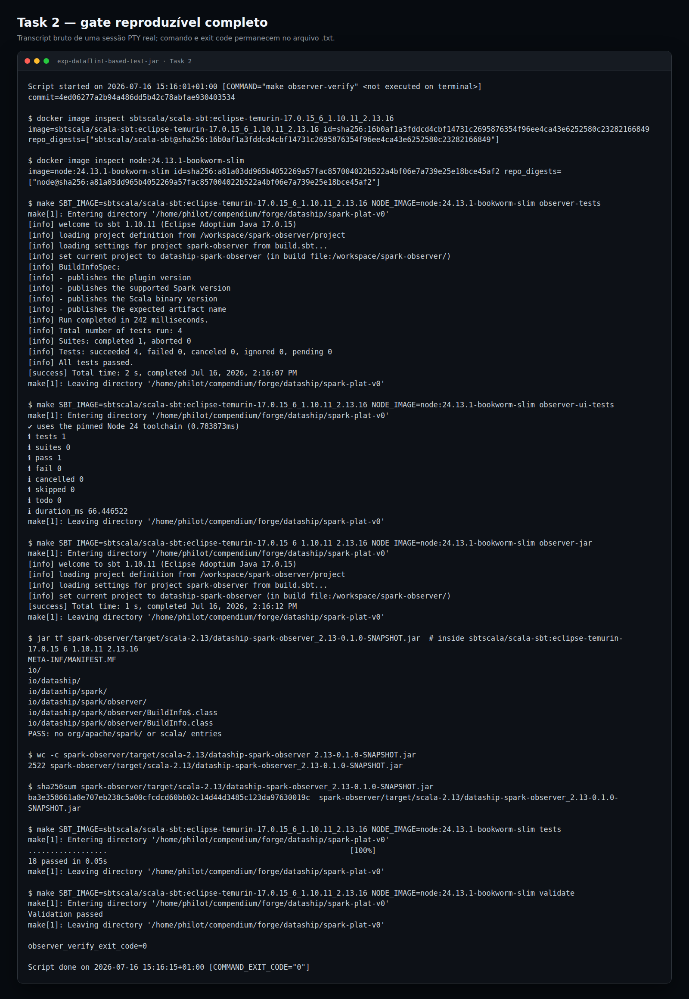
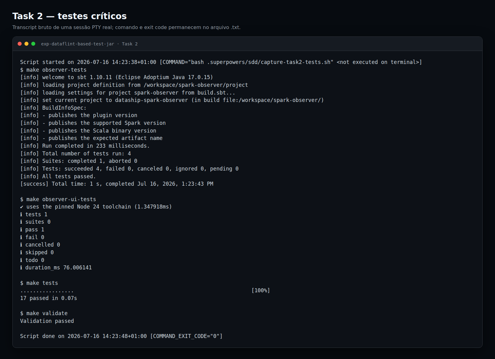
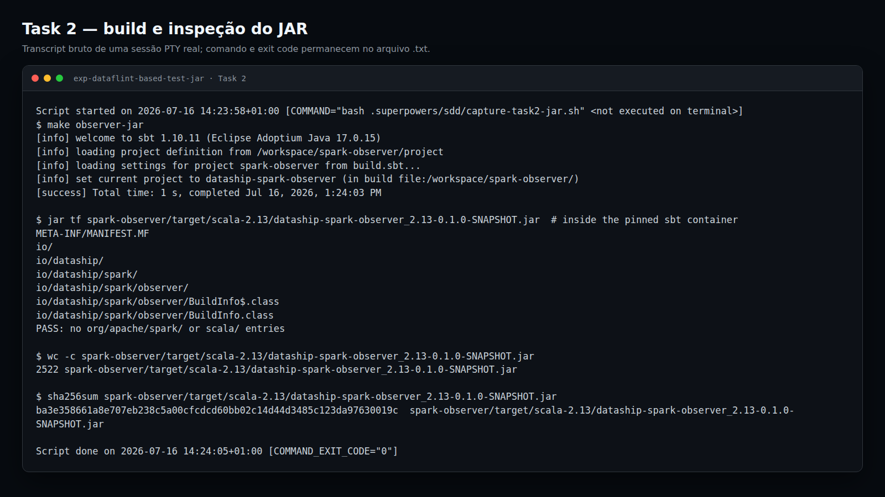

# Task 2 — relatório visual do toolchain Spark Observer

**Status:** READY — aguardando ACEITO do usuário

Nota de consistência: referências a dependências Scala `2.13.16` nas seções históricas abaixo descrevem somente a tentativa intermediária rejeitada. A configuração atual é `2.13.17`; a única referência atual a `2.13.16` é a tag fixada da imagem sbt.

## Toolchain fixado

| Camada | Imagem fixada | Digest observado no bootstrap | Versões verificadas |
| --- | --- | --- | --- |
| JVM / Scala / sbt | `sbtscala/scala-sbt:eclipse-temurin-17.0.15_6_1.10.11_2.13.16` | `sha256:16b0af1a3fddcd4cbf14731c2695876354f96ee4ca43e6252580c23282166849` | Java `17.0.15`; sbt `1.10.11`; tag da imagem `2.13.16`; projeto/runtime Spark Scala `2.13.17` / binário `2.13` |
| JavaScript | `node:24.13.1-bookworm-slim` | `sha256:a81a03dd965b4052269a57fac857004022b522a4bf06e7a739e25e18bce45af2` | Node `24.13.1`; teste exige major `24` |
| Spark API | dependências Maven no build sbt | — | Spark Core `4.1.2` e Spark SQL `4.1.2`, ambos `provided` |

## Fronteira host/container

| Ferramenta | Estado no host | Uso pelo Observer |
| --- | --- | --- |
| `java` | ausente do `PATH` | somente dentro da imagem sbt |
| `scalac` | ausente do `PATH` | somente dentro da imagem sbt |
| `sbt` | ausente do `PATH` | somente dentro da imagem sbt |
| `node` | presente como `24.13.1` | não utilizado; o target monta o checkout read-only na imagem Node fixada |

Os targets `observer-tests` e `observer-jar` executam como UID/GID do host, montam caches em `build/cache/sbt` e `build/cache/coursier` e trabalham em `/workspace/spark-observer`. O target `observer-ui-tests` executa somente o runner `node --test` da imagem fixada.

## Resultados finais

| Gate | Resultado |
| --- | --- |
| Contrato Python | `make tests`: `18 passed in 0.06s` |
| Contrato focado da plataforma | `6 passed` |
| Scala | `make observer-tests`: `4/4` |
| Node conteinerizado | `make observer-ui-tests`: `1/1` |
| Build do JAR | `make observer-jar`: exit `0` |
| Validação | `make validate`: exit `0` |

## Evidência visual do terminal

### Gate reproduzível completo — evidência primária



Transcript auditável: [`task-02-reproducible-verification.txt`](task-02-reproducible-verification.txt).

O transcript foi criado diretamente com:

```bash
script -qefc 'make observer-verify' \
  docs/spark-observer/evidence/task-02/task-02-reproducible-verification.txt
```

O header contém `COMMAND="make observer-verify"`, sem wrapper intermediário. O target e seu script estão em arquivos do repositório. A execução imprime:

- commit `4ed06277a2b94a486dd5b42c78abfae930403534`, no qual o script e o target já estavam versionados;
- imagens sbt e Node completas;
- IDs e `RepoDigests` reais das duas imagens;
- ScalaTest `4/4`;
- Node `1/1`;
- Python `18/18`;
- `Validation passed`;
- build e listagem do JAR;
- ausência de classes Spark/Scala;
- tamanho e SHA-256 do artefato;
- `observer_verify_exit_code=0`;
- `COMMAND_EXIT_CODE="0"`.

### Capturas anteriores — evidência histórica

As imagens abaixo foram geradas com Playwright a partir de transcripts capturados por `script` em sessões PTY reais. Elas permanecem preservadas como histórico, mas chamavam helpers não versionados e não são mais a evidência primária do gate.

### Testes críticos



Transcript auditável: [`task-02-tests-terminal.txt`](task-02-tests-terminal.txt).

Essa execução mostra:

- `make observer-tests`: ScalaTest `4/4`;
- `make observer-ui-tests`: Node `1/1`;
- `make tests`: Python `17/17`;
- `make validate`: `Validation passed`;
- exit code final `0`.

Não existe transcript bruto do RED original por ausência de `BuildInfo`. O RED continua documentado no execution log, mas não foi recriado artificialmente removendo código.

### Build e inspeção do JAR



Transcript auditável: [`task-02-jar-terminal.txt`](task-02-jar-terminal.txt).

Essa execução mostra:

- `make observer-jar` concluído;
- listagem completa do artefato dentro da imagem sbt fixada;
- nenhuma entrada `org/apache/spark/` ou `scala/`;
- tamanho de `2522` bytes;
- SHA-256 `ba3e358661a8e707eb238c5a00cfcdcd60bb02c14d44d3485c123da97630019c`;
- exit code final `0`.

## Artefato

| Campo | Valor |
| --- | --- |
| Caminho | `spark-observer/target/scala-2.13/dataship-spark-observer_2.13-0.1.0-SNAPSHOT.jar` |
| Tamanho | `2522` bytes |
| SHA-256 | `ba3e358661a8e707eb238c5a00cfcdcd60bb02c14d44d3485c123da97630019c` |
| Classes Spark empacotadas | nenhuma entrada `org/apache/spark/` |
| Classes Scala empacotadas | nenhuma entrada `scala/` |

### Conteúdo listado dentro do container

```text
META-INF/MANIFEST.MF
io/
io/dataship/
io/dataship/spark/
io/dataship/spark/observer/
io/dataship/spark/observer/BuildInfo$.class
io/dataship/spark/observer/BuildInfo.class
```

Resultado da verificação:

```text
PASS: no org/apache/spark/ or scala/ entries
```

## Contrato de compatibilidade publicado

| Campo | Valor |
| --- | --- |
| `BuildInfo.PluginVersion` | `0.1.0-SNAPSHOT` |
| `BuildInfo.SupportedSparkVersion` | `4.1.2` |
| `BuildInfo.ScalaBinaryVersion` | `2.13` |
| Nome do artefato | `dataship-spark-observer_2.13-0.1.0-SNAPSHOT.jar` |

Este arquivo é a evidência visual renderizável da Task 2. Nenhuma UI de produto foi adicionada.

## Correções pós-review

| Finding aceito | Correção implementada | Evidência local |
| --- | --- | --- |
| Scala não estava explicitamente `Provided` | `autoScalaLibrary := false` e `org.scala-lang:scala-library:2.13.17` declarado em `Provided` | contrato estático focado passou |
| Contrato do History incompleto | teste cobre `SPARK_HISTORY_OPTS`, `spark.history.provider` e `spark.eventLog.logStageExecutorMetrics` | contrato semântico passou |
| Cache aceitava qualquer entrada | marker SHA-256 vinculado a `SBT_IMAGE`, `build.sbt` e `build.properties`; validação exige marker atual, `sbt/boot` e `coursier/https` não vazios | contrato de scripts e `bash -n` passaram |
| Parser frágil | parser ignora linhas vazias/comentários e aceita caminho focado para teste | teste do parser passou |

### Ciclo focado

| Fase | Comando | Resultado |
| --- | --- | --- |
| RED | `uv run pytest tests/test_observer_platform_contract.py -q` | exit `1`; `3` falhas esperadas |
| GREEN | `uv run pytest tests/test_observer_platform_contract.py -q` | exit `0`; `4 passed` |
| Regressão local | `make tests` | exit `0`; `16 passed in 0.05s` |
| Sintaxe | `bash -n build/scripts/bootstrap.sh build/scripts/validate-bootstrap.sh` | exit `0` |

A validação Docker desta rodada intermediária foi posteriormente substituída pela rodada final pós-alinhamento 2.13.17 registrada abaixo.

### Rodada Docker pré-override

| Verificação | Resultado |
| --- | --- |
| Bootstrap / marker | PASS; fingerprint esperado com prefixo `8adcc1…`; `sbt/boot` e `coursier/https` não vazios |
| Validação | PASS |
| Scala | `4/4` |
| Node | `1/1` |
| Python | `16/16` |
| Build / JAR | PASS; `2522` bytes; SHA-256 `ba3e358661a8e707eb238c5a00cfcdcd60bb02c14d44d3485c123da97630019c` |
| Conteúdo | listing existente preservado; sem `org/apache/spark/` ou `scala/` |

O comando diagnóstico `show Provided / managedClasspath` não existe no sbt. A comparação válida mostrou Scala/Spark em `Compile / managedClasspath` e `Runtime / managedClasspath` vazio, confirmando `Provided`.

Ela também mostrou eviction para `scala-library-2.13.18.jar`: Spark `4.1.2` declara `2.13.17`, enquanto seu `jackson-module-scala_2.13:2.21.2` transitivo declara `2.13.18`.

### Tentativa intermediária de fixação em 2.13.16

| Fase | Resultado |
| --- | --- |
| RED | contrato focado falhou somente pela ausência de `dependencyOverrides` para `scala-library:2.13.16` |
| Implementação | `dependencyOverrides += "org.scala-lang" % "scala-library" % "2.13.16"` |
| GREEN | `4 passed` |
| Regressão local | `16 passed in 0.05s`; Bash e diff checks verdes |

Esse override alterou `spark-observer/build.sbt` e invalidou o marker anterior por design. No bootstrap seguinte, Coursier encerrou com exit `2` por conflito `SameVersion`: library `2.13.16` versus reflect `2.13.17`. A tentativa foi rejeitada.

### Alinhamento final ao Scala do runtime Spark

| Evidência | Resultado |
| --- | --- |
| Runtime Spark | `scala-library-2.13.17.jar`, `scala-reflect-2.13.17.jar`; `spark-submit` reporta Scala `2.13.17` |
| RED | contrato atualizado para `2.13.17` falhou somente porque o build ainda estava em `2.13.16` |
| Build | `scalaVersion` `2.13.17`; library `2.13.17` em `Provided`; overrides de library e reflect em `2.13.17` |
| GREEN local | `4 passed`; regressão `16 passed in 0.05s`; Bash/diff checks verdes |
| Imagem sbt | tag continua fixada em `..._2.13.16`; sbt resolve compiler/dependências do projeto em `2.13.17` |

O plano da Task 2 foi corrigido para refletir o runtime observado e adicionado ao próprio allowlist/checkpoint.

### Verificação final pós-alinhamento 2.13.17

| Verificação | Evidência final |
| --- | --- |
| Bootstrap | exit `0` |
| Marker | fingerprint esperado e observado: `ca234188d67de43708a5fb97c9cbfce97fffd48ec68559f232563d26437bbdf3` |
| Cache sbt | `build/cache/sbt/boot` válido e não vazio |
| Cache Coursier | `build/cache/coursier/https` válido e não vazio |
| Validação | `make validate`, exit `0` |
| ScalaTest | `make observer-tests`, `4/4` |
| Build | `make observer-jar`, exit `0` |
| Node | `make observer-ui-tests`, `1/1` |
| Python | `make tests`, `17/17` após o hardening do re-review |
| Compile classpath | `scala-library:2.13.17`, `scala-reflect:2.13.17`, Spark Core/SQL `4.1.2` |
| Runtime classpath | vazio; dependências Scala/Spark permanecem `Provided` |
| JAR | `2522` bytes; SHA-256 `ba3e358661a8e707eb238c5a00cfcdcd60bb02c14d44d3485c123da97630019c`; listing exato abaixo preservado; sem classes Spark/Scala |

```text
META-INF/MANIFEST.MF
io/
io/dataship/
io/dataship/spark/
io/dataship/spark/observer/
io/dataship/spark/observer/BuildInfo$.class
io/dataship/spark/observer/BuildInfo.class
```

Estado: `READY — aguardando ACEITO do usuário`. Este relatório não marca a Task 2 como `PASS` ou `ACEITO`.

### Hardening final do contrato de History

`SPARK_HISTORY_OPTS` agora é tokenizado com `shlex.split`. O contrato exige exatamente um token:

```text
-Dspark.history.fs.logDirectory=s3a://${MINIO_LOG_BUCKET:-spark-logs}/events
```

O teste focado também rejeita drift do caminho e propriedades duplicadas.

| Fase | Resultado |
| --- | --- |
| RED | `uv run pytest tests/test_observer_platform_contract.py -q`: exit `1`; `NameError` porque o helper token-level ainda não existia |
| GREEN | mesmo comando: `5 passed` |
| Regressão | `make tests`: `17 passed in 0.05s` |
| Diff | `git diff --check`: exit `0` |

### Re-review independente final

| Critério | Resultado |
| --- | --- |
| Spec compliant | Yes |
| Quality | Ready |
| Critical | `0` |
| Important | `0` |
| Minor | `0` |
| Actionable issues | nenhum |

Conclusão documental: `READY — aguardando ACEITO do usuário`.
