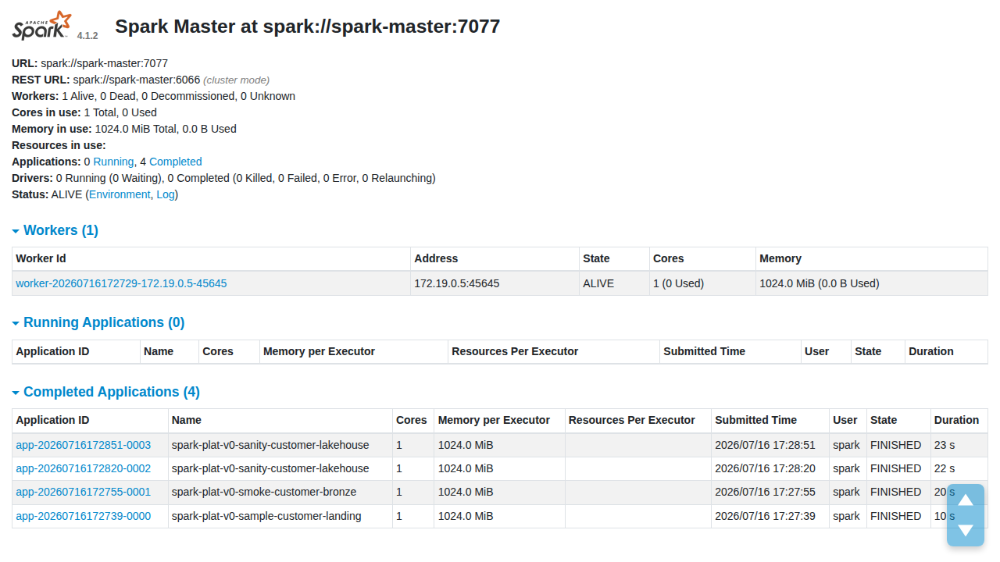

# Task 3 — minimal plugin bootstrap evidence

## Authoritative acceptance identity

The Task 3 acceptance run was captured directly with:

```text
script -qefc 'make observer-bootstrap-verify' docs/spark-observer/evidence/task-03/task-03-bootstrap-verification.txt
```

| Identity field | Captured value |
| --- | --- |
| Start/end commit | `c4d014caa55c935596b323ede6f66736594cb708` |
| Start/end Task 3 fingerprint | `50e5a70b92511257f7d22525ef1100c77617b42f0db41112c606adb80b739e1d` |
| Runtime image | `spark-plat-v0-spark:4.1.2` |
| Runtime image ID/repository digest | `sha256:ba58541d76f336354e6fadcf2c9dd6adcc2ef1c984b6ec15bea8b83700e48cff` |
| Verifier result | `observer_bootstrap_verify_status=PASS` |
| Verifier exit | `observer_bootstrap_verify_exit_code=0` |
| Transcript exit | `COMMAND_EXIT_CODE="0"` |

The verifier fingerprints an explicit versioned allowlist before and after all
live gates. It excludes `.env`, ignored work files, reports, and generated
evidence. The identical start/end commit and fingerprint bind the runtime
proof to the reviewed Task 3 implementation.

## Independent controller repeat

After the independent re-review approved the task, the controller repeated the
same versioned gate directly:

```text
script -qefc 'make observer-bootstrap-verify' docs/spark-observer/evidence/task-03/task-03-controller-verification.txt
```

The repeat produced the same start/end commit and fingerprint, the same JAR
checksum, identical plugin-off/plugin-on workload results, and final
`observer_bootstrap_verify_status=PASS` with exit code `0`. The Spark Master
screenshot and JSON below were regenerated after this controller run.

## Side-by-side result

| Proof | Plugin off | Plugin on |
| --- | --- | --- |
| Activation | JAR present on `/opt/spark/jars/`; no `spark.plugins` flag | `spark.plugins=io.dataship.spark.observer.SparkDataShipPlugin` and `spark.dataship.observer.enabled=true` |
| Driver component | Not initialized | Spark logged `Initialized driver component for plugin io.dataship.spark.observer.SparkDataShipPlugin.` |
| Executor component | None | None; `executorPlugin() == null` is covered by `PluginBootstrapSpec` |
| Workload | `make smoke`, exit `0` | Existing `check_sanity.py`, exit `0` |
| Sanity result | `landing_rows=5 bronze_rows=5 country_groups=2` | `landing_rows=5 bronze_rows=5 country_groups=2` |
| DataShip route/UI | Absent | Absent |

## Runtime and artifact

| Gate | Result |
| --- | --- |
| Runtime refresh | Exit `0` after image rebuild and master/worker recreation |
| Master readiness | HTTP `200` |
| Worker readiness | `1` registered worker in state `ALIVE` |
| Readiness tests | `5/5`, including rejection of a ready response received after the deadline |
| Scala tests | `9/9` |
| Python regression tests | `24/24` |
| Node tests | `1/1` |
| Host JAR SHA-256 | `6cfc48c8943666de90bd134bec0bda4a1f4bb84202472c5c4cc98a1d4a27cefa` |
| Container JAR SHA-256 | `6cfc48c8943666de90bd134bec0bda4a1f4bb84202472c5c4cc98a1d4a27cefa` |
| JAR contents | Bootstrap/config classes only; no Spark or Scala runtime classes |

## Visual evidence



The two completed `spark-plat-v0-sanity-customer-lakehouse` rows are the
plugin-off and plugin-on comparison. The screenshot is backed by
`spark-master-plugin-bootstrap.json` and was regenerated after the
authoritative verifier. The JSON records one `ALIVE` worker and the four
completed Task 3 applications: landing, bronze, plugin-off sanity, and
plugin-on sanity.

No driver port is published in Task 3. The expected checks remain:

- Compose mapping for `spark-master:4040`: absent, exit `1`;
- `http://127.0.0.1:24040/dataship/`: connection refused, exit `7`.

The earlier runtime, checksum, workload, regression, and route transcripts are
retained as historical implementation evidence. For acceptance, they are
superseded by the single identity-bound
`task-03-bootstrap-verification.txt` transcript.
