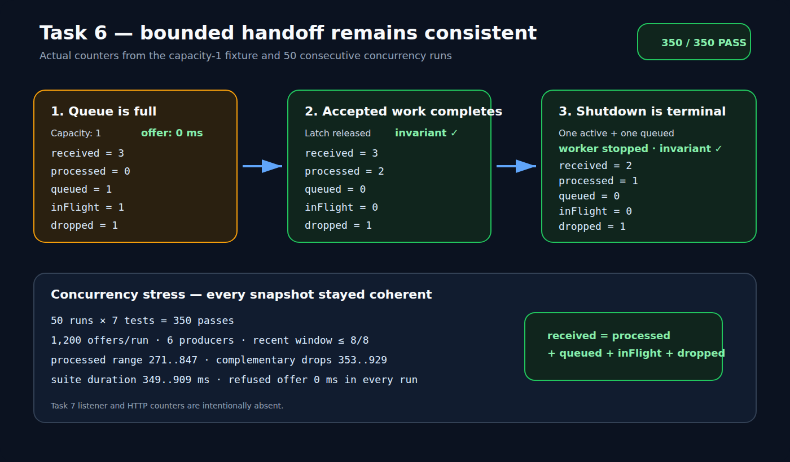

# Task 6 bounded handoff — visual acceptance report

**Result:** `PASS — awaiting user acceptance`

**Starting HEAD:** `d8f0e31b6521f856c870e16d1c3e890307e7aae2`

**Date:** 2026-07-20

## Deterministic capacity-1 sequence

| Observation | Received | Processed | Queued | In flight | Dropped | Invariant | Observed time |
| --- | ---: | ---: | ---: | ---: | ---: | --- | ---: |
| First event held; second queued; third refused | 3 | 0 | 1 | 1 | 1 | `3 = 0 + 1 + 1 + 1` | refused offer: `0 ms` |
| Latch released; accepted events complete | 3 | 2 | 0 | 0 | 1 | `3 = 2 + 0 + 0 + 1` | bounded wait passed |
| Shutdown with one active and one queued | 2 | 1 | 0 | 0 | 1 | `2 = 1 + 0 + 0 + 1` | worker stopped within the 5 s boundary |
| Null input | 1 | 0 | 0 | 0 | 1 | `1 = 0 + 0 + 0 + 1` | returned `false`; no exception |

The shutdown row proves that an accepted event left in the queue is not
stranded after the worker stops. It is atomically reclassified as a plugin
drop. The in-flight event finishes its accounting transition before the
worker exits.

## Concurrency and bounded-memory stress

| Gate | Observed result |
| --- | --- |
| Repetitions | `50` |
| Tests per repetition | `7` |
| Total focused tests | `350/350` passed |
| Concurrent offers per repetition | `1,200` from 6 producers |
| Processed range | `271..847` |
| Dropped range | `353..929`, always complementary to processed |
| Recent-transition window | never above `8/8` in the stress fixture |
| Focused-suite duration | `349..909 ms` |
| Refused-offer duration | `0 ms` in all 50 recorded capacity-1 runs |
| Snapshot invariant | true in every sampled snapshot |
| Worker after repeated close | not alive |

## Runtime regression

| Gate | Result |
| --- | --- |
| Full Scala suite | `30/30` passed |
| Full Python suite | `63/63` passed |
| Runtime refresh | passed after restoring the documented local-image prerequisite |
| Host / staged / container JAR | matching SHA-256 `2c2ec3ea83efef09fdd0f2046a369dd28eb63d19d52f2a57b4757aac4d009ea6` |
| Live health | two HTTP `200` responses, `READY`, same live PID `131` |
| Workload | row count `40`, value sum `780`, submit exit `0` |
| Cleanup | endpoint unavailable; driver and wrapper absent |
| Final Compose state | down; empty service table |

## Authoritative evidence

- `task-06-focused-red.txt`: original feature-level compilation RED.
- `task-06-focused-green.txt`: initial 5/5 focused GREEN.
- `task-06-review-fixes-red.txt`: independent-review findings reproduced as
  5 passes plus 2 expected failures.
- `task-06-review-fixes-green.txt`: both review fixes GREEN, 7/7.
- `task-06-focused-50-repetitions.txt`: 50 consecutive focused passes.
- `task-06-observer-tests.txt`: full Scala regression.
- `task-06-python-regression.txt`: full Python regression.
- `task-06-final-observer-tests.txt` and
  `task-06-final-python-regression.txt`: fresh pre-commit reruns of both full
  suites.
- `task-06-source-fingerprint.txt`: starting commit, branch, and SHA-256 for
  every Task 6 source and test input included in this acceptance package.
- `task-06-runtime-refresh.txt`: truthful failed first refresh caused by
  removed project-local dependency images.
- `task-06-rebuild-prerequisites.txt`: canonical `make build` recovery.
- `task-06-runtime-refresh-retry.txt`: successful retry with one ALIVE worker.
- `task-06-jar-checksum.txt`: matching artifact and image identities.
- `task-06-live-health-regression.txt`: live Task 5 health compatibility.
- `task-06-infra-down.txt` and `task-06-infra-down-verification.txt`: final
  teardown and empty Compose table.

No Task 7 listener or counters endpoint is included in this evidence.
