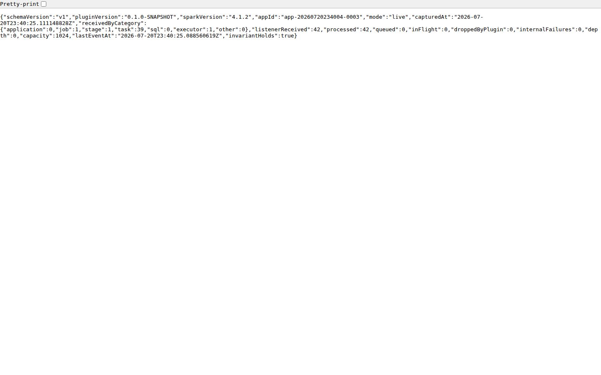
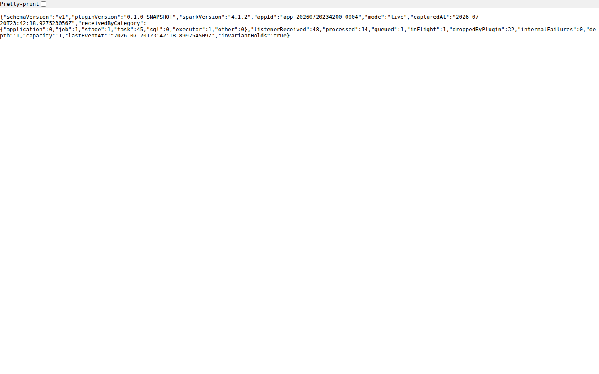

# Task 7 dedicated listener and live counters — acceptance report

**Result:** `PASS — ACCEPTED`

**Starting HEAD:** `85efbf4f0b48edd119ce59615bff5b4ff8afef6c`

**Date:** 2026-07-21

**Publication:** commit `5a5626b8b5d7913e615a0acf8b3cf5c30e562e9a`
was pushed for external validation and explicitly accepted by the user on
2026-07-21.

## Live functional proof

The canonical normal and backpressure runs used the same deterministic Spark
workload: 40 rows, value sum 780, 20 bucket totals, and submit exit code 0.

| Scenario | Driver | t1 received | t2 received | t2 drops | t2 invariant | Workload |
| --- | --- | ---: | ---: | ---: | --- | --- |
| Normal | `app-20260720233715-0000`, PID `132` | 1 | 6 | 0 | `true` | 40 rows, sum 780, exit 0 |
| Capacity 1, 1 s test delay | `app-20260720233757-0001`, PID `486` | 1 | 6 | 2 | `true` | 40 rows, sum 780, exit 0 |

Both reads in each scenario were HTTP 200 JSON responses while the recorded
driver PID was alive. The normal response grew across executor, job, stage,
and task categories. The constrained response kept one event queued and one
in flight while recording only plugin-owned drops.

The accounting relationship remained true in every response:

```text
listenerReceived = processed + queued + inFlight + droppedByPlugin
```

## Real Playwright evidence

These are browser screenshots of the live JSON endpoint itself. They are not
generated diagrams or reconstructed responses.

### Same-driver normal growth




Both screenshots use application `app-20260720234004-0003`. The browser saw
`listenerReceived` grow from 42 to 98 while `invariantHolds` stayed `true` and
`droppedByPlugin` stayed 0.

### Induced plugin backpressure



The capacity-one screenshot uses application `app-20260720234200-0004`. It
shows 48 received, 14 processed, 1 queued, 1 in flight, and 32 plugin drops;
`48 = 14 + 1 + 1 + 32`, so the response reports `invariantHolds=true`.

The corresponding visual drop run completed successfully with 80 rows, value
sum 3160, submit exit 0, endpoint cleanup, and no remaining driver process.

## Implementation contract

- The Spark 4.1.2 adapter installs `ObserverListener` on the dedicated
  listener-bus queue `dataship-observer`.
- The listener performs fixed-category classification and a nonblocking
  bounded-queue offer only. It does not perform HTTP, store reads, external
  I/O, or unbounded retention.
- Categories are fixed to `application`, `job`, `stage`, `task`, `sql`,
  `executor`, and `other`.
- `/dataship/api/v1/debug/counters` returns an allowlisted, versioned JSON
  envelope built from one atomic observer-state snapshot.
- `testMode` and `test.processingDelayMs` exist only to make the drop proof
  deterministic; nonzero delay is rejected outside explicit test mode.
- With `spark.ui.enabled=false`, neither the listener nor the HTTP handlers are
  installed and the existing `NO_SPARK_UI` fail-open lifecycle remains intact.

## Artifact identity and tests

| Gate | Result |
| --- | --- |
| Focused feature RED | Missing listener/counters/config contracts failed for the expected reasons |
| Pre-implementation live RED | Counters route returned Spark HTML instead of the required JSON contract |
| Scala GREEN | 35/35 passed |
| Targeted Python GREEN | 52/52 passed |
| Runtime refresh | Master HTTP 200 and one ALIVE worker |
| Host / staged / container JAR | matching SHA-256 `f65f49c56ec005d50e322325dcca025553ec998b79c6982920f1cdb4e6d53825` |
| Final Scala regression | 35/35 passed |
| Final Python regression | 76/76 passed |
| Final Node UI regression | 1/1 passed with pinned Node 24 |
| Final repository validation | `Validation passed` |
| Final source/document guard | syntax and compile checks passed; frozen paths unchanged; Task 8 files absent |
| Final infrastructure state | Compose service table empty |

The final regression transcripts are
`task-07-final-observer-tests.txt`, `task-07-final-python-tests.txt`,
`task-07-final-ui-tests.txt`, and `task-07-final-validate.txt`. Infrastructure
shutdown and the empty Compose service table are recorded in
`task-07-infra-down.txt` and `task-07-infra-down-verification.txt`.
The final branch, syntax, frozen-path, staged-index, Task 8 scope, and screenshot
hash checks are recorded in `task-07-final-guards.txt`.
A fresh combined acceptance run repeated Scala `35/35`, Python `76/76`, Node
`1/1`, repository validation, and `git diff --check`; its direct transcript is
`task-07-final-acceptance-verification.txt`.

## Evidence notes

- `task-07-live-normal-green.txt` and `task-07-live-drop-green.txt` are the
  canonical successful functional runs.
- `task-07-playwright-wide-t1.txt`, `task-07-playwright-wide-t2.txt`, and
  `task-07-playwright-drop.txt` are the direct Playwright command transcripts.
- `task-07-visual-wide-t1-validation.txt`,
  `task-07-visual-wide-t2-validation.txt`, and
  `task-07-visual-drop-validation.txt` record independently parsed live JSON.
- The first visual t2 capture truthfully failed because its driver completed
  between validation and browser navigation. A wider deterministic run then
  produced both same-driver screenshots. That wider visual-only run exceeded
  the original 90-second harness timeout after the screenshots and cleaned up
  with exit 124; it is not used as the functional PASS. The canonical normal
  run and the final visual drop run both completed with exit 0.

## Remaining risk

Unexpected exceptions thrown by `process(event)` are not yet converted into
`internalFailures`; the accepted Task 6 follow-up assigns that fail-open proof
to Task 11. Task 7 exposes the stable counter field but does not claim that
later hardening as complete.

A final read-only code review found no Critical or Important issue and judged
Task 7 ready for user acceptance. It identified three nonblocking hardening
items for the later lifecycle/fail-open work: attempt every handler/listener
cleanup even if one detach throws, add an adapter-level listener
installation/removal regression test, and define the pre-first-event
`lastEventAt` representation explicitly instead of relying on the live probe
receiving an early executor event.

No Task 8 snapshot or store-reading behavior is included.
